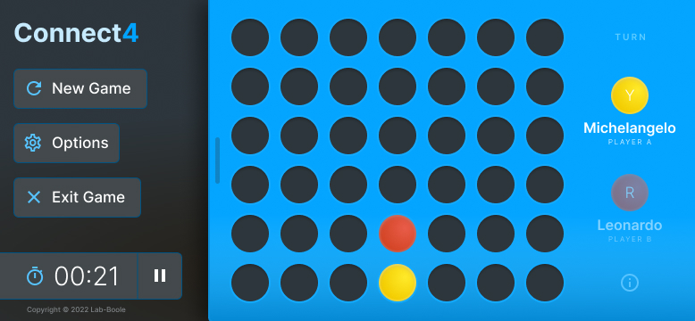
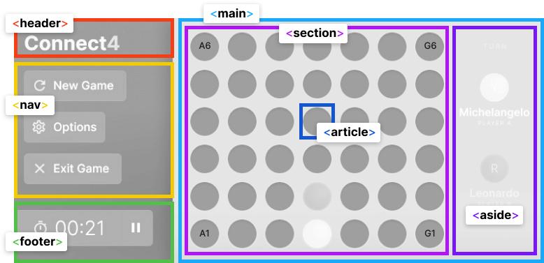

# game-connect4.0.0.publicationLanguage
Universo Santa Tecla  
[uSantaTecla@gmail.com](mailto:uSantaTecla@gmail.com)  
  
## requirements 

* Escribe con un lenguaje de publicación (html) un tablero lo "más" parecido posible al juego Connect4

 

 
 

# ui mockup v0.2

*Mobile UI design for mobile devices with started game state*

 
 

# ui base layout

*Mobile UI layout using main semantic tags*

 
 

# experimental html & css for mobile

## ui html layout

> ## [ html layout file ](../0.0.publicationLanguage/connect4-ui-layout.html)

 

## ui css styles

> ## [ css file ](../0.0.publicationLanguage/css/app.css)