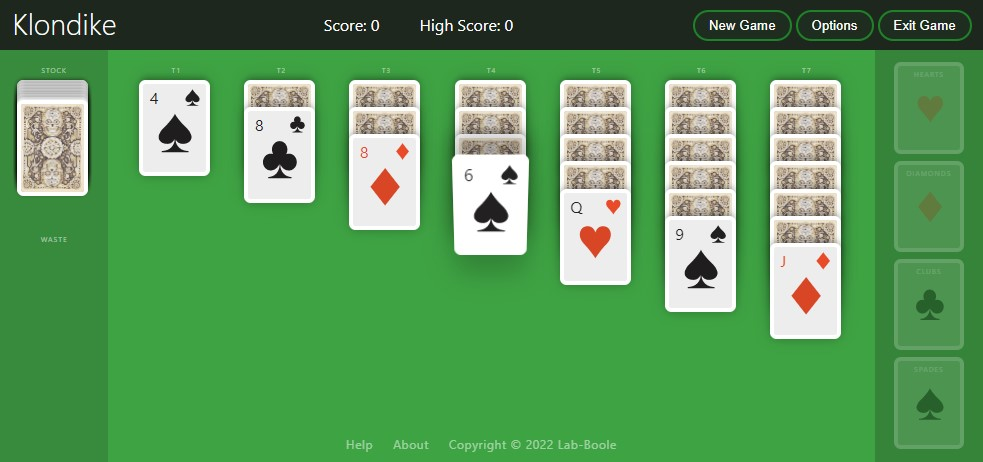

# game-klondike.0.0.publicationLanguage
Universo Santa Tecla  
[uSantaTecla@gmail.com](mailto:uSantaTecla@gmail.com)  
  
## requirements 

* Escribe con un lenguaje de publicación (html/css, svg, ...) un tablero lo "más" parecido posible a la siguiente imagen

 

 
 

# responsive & fluid html & css

*Capture from final result*

 

## ui html layout

> ## [ html layout file ](../0.0.publicationLanguage/klondike-ui-layout.html)

 

## ui css styles

> ## [ css file ](../0.0.publicationLanguage/css/klondike-style-v1.css)